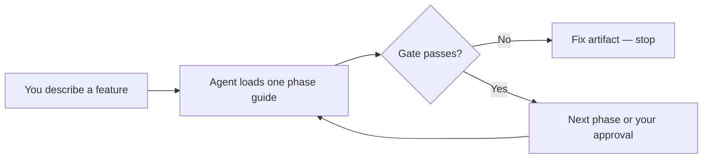
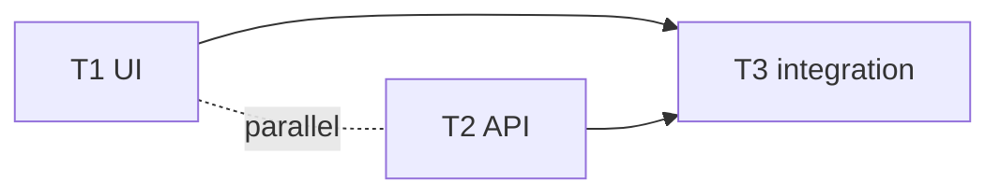
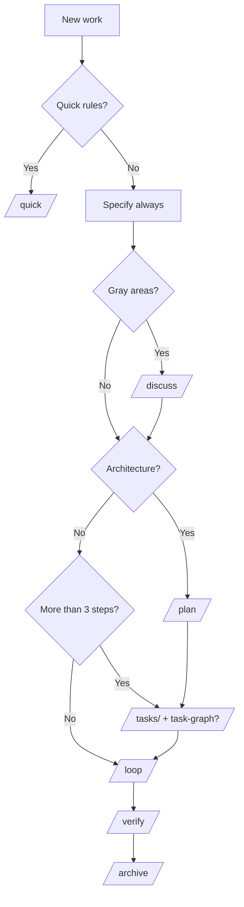

# Concepts — spec-driven, seatbelt, loop, and graph

Four ideas work together. You do not need to memorize jargon — this page explains how they connect.

## Spec-driven development (SDD)

**Write the goal before the code. Prove it before calling it done.**

| Step | Artifact | Question answered |
| --- | --- | --- |
| Specify | `spec.md` | What must happen? What is out of scope? |
| Tasks | `tasks.md` | What are the small, checkable jobs? |
| Execute | code + commits | Did each job pass tests and gates? |
| Verify | `validation.md` | Would a stranger believe it is done? |

Everything lives under `.specs/` in your repo so the next chat session can continue without re-explaining the project.

## Seatbelt (this package)

The **seatbelt** is the process kit: hub skill, phase references, sister skills, and Python **gates** that stop the agent when paperwork or evidence is incomplete.



Without the seatbelt, agents often jump to code and say “done”. With it, **incomplete specs, empty stubs, and missing test evidence fail automatic checks** before you waste time reviewing fake progress.

## Loop engineering (Execute)

**Loop** here means the **Execute** phase: implement in **waves**, not one giant dump.

```mermaid
flowchart TD
  LP[loop-plan] --> W{Next wave}
  W -->|1 task| T[Test → implement → gate → commit]
  W -->|2+ parallel tasks| P[Sub-agents on disjoint files]
  T --> LP
  P --> M[Merge + project harness]
  M --> LP
  LP -->|All tasks done| V[/verify]
```

- **`loop-plan`** reads `tasks.md` and returns the next runnable tasks (respecting dependencies and file ownership).
- **Parallel groups** run only when tasks touch **disjoint files** — see [task graph](#graph-engineering).
- **Correction loop:** if tests fail, fix and retry (bounded) before escalating to you.

Operational loops (CI triage, dependency sweeps) are a different idea — see [loop-patterns.md](loop-patterns.md).

## Graph engineering (parallel work)

When a feature has **3+ tasks** or parallel work, the agent draws a **task graph** (`task-graph.md`): which jobs can run at the same time and which must wait.



Rules (from `task-graph-engineering.md`):

- One owner per file per wave — no two agents edit the same file unless the graph says so.
- **Merge** has one owner who resolves conflicts and runs the project harness.
- Fake edges and oversized “parallel” groups are caught by `validate-tasks`.

## Complexity tiers — how the agent chooses depth

Yes — **“How work flows”** is exactly this: the hub **Complexity Router** looks at the feature and picks how much ceremony to use.

| Tier | Typical scope | Agent path |
| --- | --- | --- |
| **Quick** | ≤3 files, no new deps, no auth/payments | `/quick` → verify → commit |
| **Simple** | Small localized change (2–5 files) | `/specify` → `/loop` → `/verify` |
| **Medium** | New feature, &lt;10 tasks | `/specify` → `/tasks` → `/loop` → `/verify` → `/archive` |
| **Complex** | New APIs, architecture, infra | + `/discuss`, `/plan`, optional AppSec/QA on verify |
| **Parallel** | Splittable work, multiple agents | Above + `/task-graph` |



**Specify** and **Verify** are always required on the full pipeline (Quick is the express exception). The agent may skip Discuss, Plan, or Tasks when the scope is small — but if Execute reveals more than ~5 steps, it must go back and formalize `tasks.md`.

## How the four ideas stack

| Layer | Role |
| --- | --- |
| **Spec-driven** | *What* to build and *how we know it is done* |
| **Seatbelt** | Skills + gates that enforce the process |
| **Loop** | *How* to implement in waves (`loop-plan`, sub-agents) |
| **Graph** | *When* tasks can run in parallel safely |

## Related

- [How it works](How-it-works.md) — narrative from goal to done
- [Agent commands](agent-commands.md) — chat commands per phase
- [Skills and hub](skills-and-hub.md) — which files the agent loads
- [Gates reference](gates.md) — automatic brakes at each step
