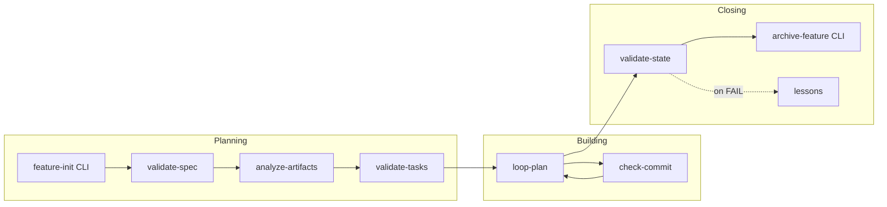
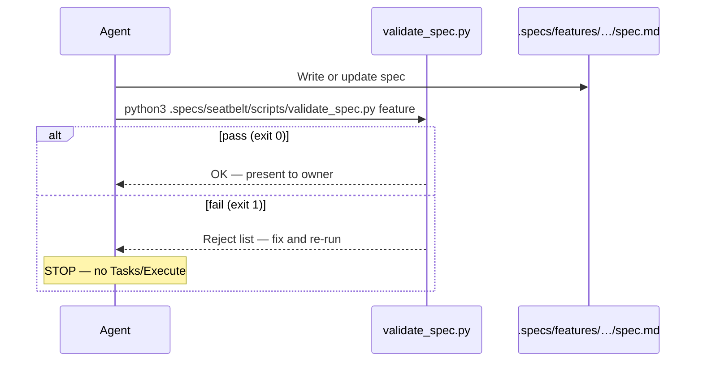

# Gates reference — how automatic brakes work

Gates are **Python scripts** in `.specs/seatbelt/scripts/`. The agent (or you) runs them at phase boundaries.

**Exit code 0** = pass. **Non-zero** = stop, fix the artifact, re-run. Gates do not replace your judgment — they block **structural** gaps (empty specs, fake done, bad commit titles).

## Pipeline placement



## Gate catalog

| Gate | Script / CLI | When | What it checks |
| --- | --- | --- | --- |
| **validate-spec** | `validate_spec.py` | Before you approve `spec.md` | Required sections, `SHALL`/`MUST` criteria, assumptions |
| **analyze-artifacts** | `analyze_artifacts.py` | Before task approval; on drift | Every REQ has task coverage; no orphan tasks |
| **validate-tasks** | `validate_tasks.py` | Before you approve `tasks.md` | Task shape, binary done criteria, `task-graph.md` when 3+ tasks, file overlap |
| **loop-plan** | `loop_plan.py` | Start of each `/loop` wave | Next runnable tasks; parallel groups (disjoint files) |
| **check-commit** | `check_commit.py` | Every commit | Conventional Commits shape |
| **validate-state** | `validate_state.py` | Before declaring feature done | PASS verdict, evidence cites `file:line`, no open gaps |
| **lessons** | `lessons.py` | After Verify FAIL | Grounded lessons only — no self-declared wisdom |
| **archive-feature** | CLI | After Verify PASS | Merges feature into domain memory |

## How a gate run works



### Arguments

Most gates accept:

- Feature name (`001-auth`)
- Feature directory (`.specs/features/001-auth`)
- Path to artifact (`spec.md`, `tasks.md`)

With **one** feature in the repo, the argument is optional. With **several**, the gate lists candidates and exits **2** until you pick.

### Degraded mode

If Python is unavailable, the agent performs the **same checklist manually** by reading the artifact against the reference procedure. The standard does not drop — only who runs the check changes.

## What gates block vs guide

| Hard block (script) | Guided only (skills) |
| --- | --- |
| Missing spec sections | How deep a discussion went |
| Empty code stubs | Perfect prose in every section |
| Tasks without REQ coverage | “Enough” product taste |
| Fake PASS without test paths | Whether a test is clever |

Freeze policy for maintainers: [Gates and guarantees](Gates-and-guarantees.md) · [ADR 0001](../adr/0001-harness-freeze-v0.7.md).

## Running gates yourself

```bash
npx @luizsantiago/spec-seatbelt validate-spec auth
npx @luizsantiago/spec-seatbelt validate-tasks auth
npx @luizsantiago/spec-seatbelt loop-plan auth --json
npx @luizsantiago/spec-seatbelt validate-state auth
npx @luizsantiago/spec-seatbelt check-commit --message "feat(auth): add session"
npx @luizsantiago/spec-seatbelt lessons list --status confirmed
```

`doctor` checks that scripts exist, Python works, and suggests `loop-plan` when Execute is next.

## Related

- [Concepts](concepts.md) — where gates sit in the seatbelt model
- [Agent commands](agent-commands.md) — which command triggers which gate
- [Skills and hub](skills-and-hub.md) — hub gate schedule table
