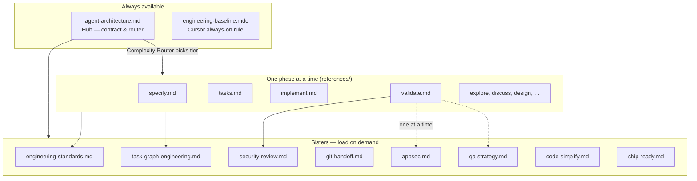
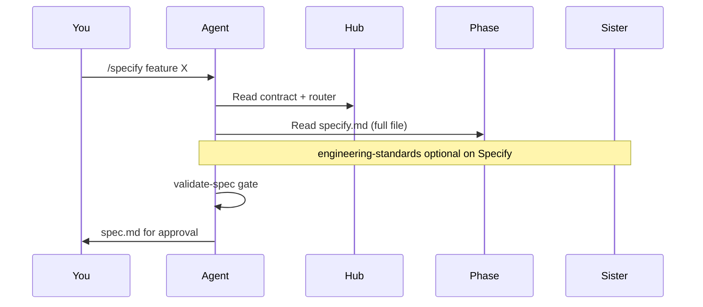

# Skills and hub — what install copies

After `install`, the agent does **not** load the whole library every turn. It loads a **working set**: the hub, one phase reference, and optionally one sister skill.

## Architecture overview

## Hub — `agent-architecture.md`

| Responsibility | Detail |
| --- | --- |
| **Contract** | Test-first, gate-before-done, author ≠ verifier, git tiers |
| **Phase map** | Which reference to open for Specify, Tasks, Loop, Verify, … |
| **Complexity router** | Quick / Simple / Medium / Complex / Parallel — how deep to go |
| **Gate schedule** | When to run each Python script |
| **Memory map** | What belongs under `.specs/` |

The hub is the **map**. It does not replace phase procedures — the agent still reads the full reference for the current phase.

## Phase references (`references/`)

Loaded **one per turn** (plus hub). Each file is a step-by-step procedure.

| Reference | Agent command | Phase |
| --- | --- | --- |
| `explore.md` | `/explore` | Research — no feature folder yet |
| `constitution.md` | `/constitution` | Once — project principles |
| `project-init.md` | `/project-init` | Brownfield repo map |
| `specify.md` | `/specify` | Written requirements |
| `discuss.md` | `/discuss` | Gray product decisions |
| `design.md` | `/plan` | Technical design |
| `tasks.md` | `/tasks` | Atomic job list |
| `analyze.md` | `/analyze` | Spec ↔ tasks consistency |
| `implement.md` | `/loop` | Execute waves + `loop-plan` |
| `validate.md` | `/verify` | Independent proof |
| `archive.md` | `/archive` | Fold into domain memory |
| `converge.md` | `/converge` | Recover from drift |
| `memory.md` | `/handoff` | Session snapshot |
| `quick-mode.md` | `/quick` | Tiny fix lane |
| `context-limits.md` | (load rule) | Token / context discipline |
| `lessons.md` | `/lessons` | Learn from verify failures |
| `sub-agents.md` | (with `/loop`) | Parallel dispatch protocol |

## Sister skills (cross-cutting)

| Skill | When loaded | What it does |
| --- | --- | --- |
| `engineering-standards.md` | Execute | Secure coding, commits, artifact language |
| `task-graph-engineering.md` | 3+ tasks, `/task-graph`, parallel `/loop` | DAG rules, file ownership, merge owner |
| `security-review.md` | Verify | OWASP-style checklist |
| `git-handoff.md` | Handoff, archive | Commit `.specs/`, session continuity |
| `appsec.md` | **Conditional** — Complex or attack surface | Deeper security pass — **one at a time** |
| `qa-strategy.md` | **Conditional** — multi-step UI or owner ask | QA focus — after AppSec if both apply |
| `code-simplify.md` | **Conditional** — Medium+ or owner ask | Refactor without behavior change |
| `ship-ready.md` | **Conditional** — owner asks to ship | Pre-release checklist — never auto-push |

**Conditional rule:** load **at most one** conditional sister at a time. Sequence: AppSec → drop → QA → drop.

## Always-on project rule

`engineering-baseline.mdc` in `.cursor/rules/` points Cursor at the hub and lists installed skills/gates. Re-run `install` to refresh maps without losing your prose.

## Progressive loading (why tokens stay low)

A **Specify** turn loads ~5 files (~9k est. tokens). Dumping every skill and reference every turn would be ~31k tokens — see [Token efficiency](Token-efficiency.md).

## Where files land after install

| Path | Contents |
| --- | --- |
| `.cursor/skills/agent-architecture.md` | Hub |
| `.cursor/skills/references/*.md` | Phase procedures |
| `.cursor/skills/*.md` | Sister skills |
| `.claude/skills/` | Same tree for Claude Code |
| `.cursor/rules/engineering-baseline.mdc` | Always-on rule |

## Related

- [Agent commands](agent-commands.md) — chat phrases per phase
- [Gates reference](gates.md) — scripts the hub schedules
- [Concepts](concepts.md) — spec-driven + loop + graph
